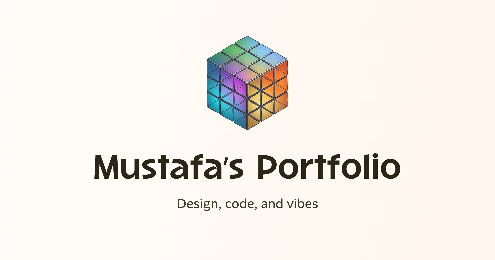

# Mustafa — product design portfolio



My public portfolio of shipped product work, case studies, and design-engineering experiments.

**[View the live portfolio →](https://mstf.work)**

## Selected work

- **Engine Immobilizer at Motive** — I led the design of a remote vehicle-immobilization experience spanning hardware, tracking, and platform surfaces. The launch supplied the final core capability needed for Motive's expansion into Mexico and contributed **$8M in ARR**. [Read the case study](https://mstf.work/engine-immobilizer.html).
- **Workflows at Educative** — a unified workflow-management system connecting documents, tasks, reviews, projects, and collaborators. I designed the product end to end and helped build an outcome-focused design team. [Read the case study](https://mstf.work/workflows.html).
- **Design-engineering experiments** — working prototypes across agentic trading, presence-first recruiting, procedural themes, Git visualization, and WebGL tools.

## About the site

The portfolio uses a deliberately compact 2×2 editorial layout. It is built with semantic HTML and custom CSS, requires no application framework or build step, and includes motion, video case-study media, responsive layouts, and an interactive 3D detail.

### Run locally

Serve the repository from a local HTTP server so media and 3D assets resolve correctly:

```bash
python3 -m http.server 4173
```

Then open [http://localhost:4173](http://localhost:4173).

## Contact

[LinkedIn](https://www.linkedin.com/in/mustafa-ali-akbar-a5195387/) · [GitHub](https://github.com/moosefroggo) · [hello@mstf.work](mailto:hello@mstf.work)
